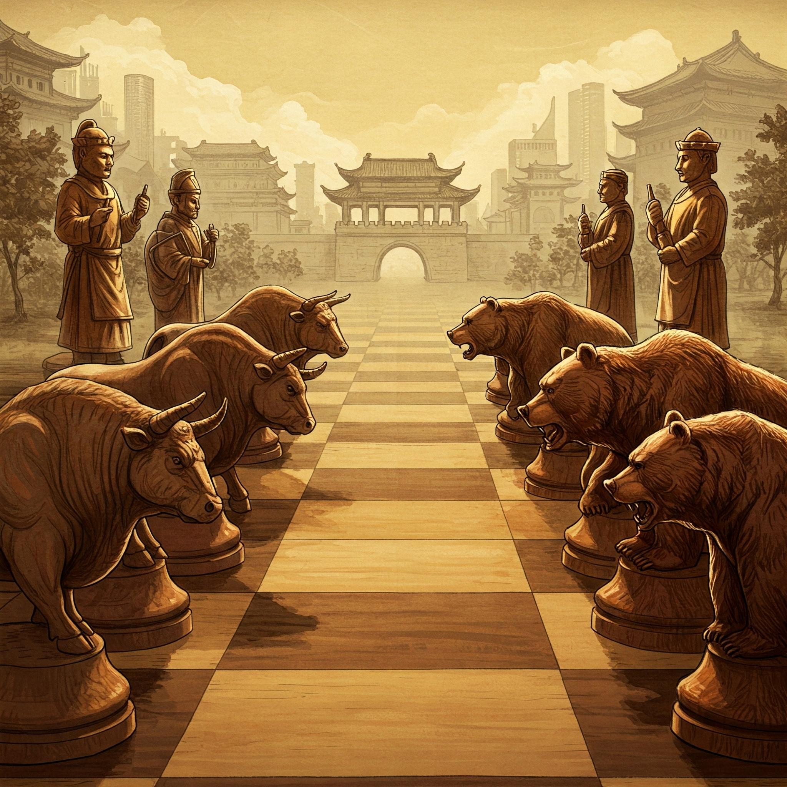

# Strategic Macroeconomic Modeling

A long-term project to model the global macroeconomic landscape as a strategic 'chess game' between the US and the Rest of the World (RoW), leveraging concepts from Control Theory, Game Theory, and Reinforcement Learning.

---

## Table of Contents

- [Strategic Macroeconomic Modeling](#strategic-macroeconomic-modeling)
  - [Table of Contents](#table-of-contents)
  - [About The Project](#about-the-project)
  - [Game-Theoretic Framework](#game-theoretic-framework)
    - [Players](#players)
    - [State Space (POMDP)](#state-space-pomdp)
    - [Action Space](#action-space)
    - [Reward Function](#reward-function)
    - [Dynamics and Policy](#dynamics-and-policy)
  - [Getting Started](#getting-started)
    - [Prerequisites](#prerequisites)
    - [Installation](#installation)
  - [Usage](#usage)
  - [Roadmap](#roadmap)

---

## About The Project

This repository houses a long-term project to model the global macroeconomic landscape as a strategic game between the **United States** and an aggregated **Rest of the World (RoW)** opponent.

The core objective is to collect and analyze extensive US and global macroeconomic data (e.g., Treasury markets, foreign bond holdings, financial assets) to create a clear view of the economic "board." The ultimate goal is to anticipate potential 'next moves' by opponents and understand policy impacts by framing the system as a dynamic game.

The model is built on concepts from:
* Optimal Control Theory
* Game Theory
* Lanchester's Laws (Theory of Combat)
* Multi-Agent Reinforcement Learning (MARL)

---

## Game-Theoretic Framework

The model is defined as a two-player (For now for the sake of simplicity), simultaneous-move game under uncertainty **Partially Observable Markov Decision Process (POMDP)**.

### Players

The game consists of two strategic agents:
* **United States (US):** The primary agent whose financial and economic value is to be modeled.
* **Rest of the World (RoW):** A single, aggregated opponent representing the collective actions and economic standing of major world economies (e.g., Japan, UK, EU, China). The actions of this agent are modeled as an aggregated policy or capital allocation stance.

### State Space (POMDP)

Players do not observe the "true" state of the world's economic health directly. Instead, they receive noisy, delayed, and incomplete observations. This introduces uncertainty, which is why the system is modeled as a POMDP.

* **True State ($s$):** A latent, unobservable vector representing the actual health and configuration of the global economy.
* **Observations ($o$):** Players receive observations $o \in \Omega$ which are proxies for the true state. These are the real-world data points that are collected:
    * **US Indicators:**
        * Economic Output & Growth (GDP, etc.)
        * Prices & Inflation (CPI, PPI, etc.)
        * Labor Market (Unemployment, NFP)
        * Interest Rates (Fed Funds, Treasury Yields)
        * Fiscal Health (Debt-to-GDP, Deficit)
        * Trade & International Position (Trade Balance, Current Account)
        * Currency Strength (Dollar Indices)
        * Market Sentiment & Stability (VIX, Financial Conditions)
        * Investment (GPDI, FDI)
        * Supply Chain (GSCPI, PMI components)
    * **RoW Indicators:**
        * Foreign holdings of US assets.
        * Relative economic performance vs. the US.
        * Global factors (e.g., global PMIs, commodity prices).
* **Belief State ($b(s)$):** Based on the history of observations, each player maintains a **belief state**, which is a probability distribution ($b(s) = \Pr(s_t=s | o_{1:t}, a_{1:t-1})$) over all possible true states. The agent's policy operates on this belief state.

### Action Space

The action space consists of the economic and policy levers each player can pull.

* **US Actions:**
    * **Fiscal Policy:** Changes in government spending and taxation.
    * **Monetary Policy:** Adjustments to interest rates and central bank balance sheet.
    * **Trade Policy:** Tariffs, trade agreements, and other trade-related measures.
* **RoW Actions:**
    * **Capital Allocation:** Aggregated decisions on buying/selling US assets (e.g., Treasuries).
    * **Reflective Policy Stance:** An aggregated representation of the RoW's collective fiscal and monetary responses, analogous to US actions.

### Reward Function

Each player's objective is to maximize their own custom utility index, which serves as the reward function.

* **US Reward:** Maximize the **"US Financial Asset Value" (UFAV)** index. This custom index is a weighted sum of positive and negative indicators:
    * **Positive components (+):** GDP growth, S&P 500 returns, low unemployment, stable inflation, high demand for US assets, currency strength (FX).
    * **Negative components (-):** High debt-to-GDP ratio, high market volatility (VIX).
* **RoW Reward:** Maximize the **"RoW Economic Value" (RoWEV)** index, a custom aggregated index representing the economic well-being of the RoW bloc.

### Dynamics and Policy

* **Transition Dynamics ($T(s'|s,a)$):** A core challenge is defining the transition probabilities—how the true state $s$ evolves into a new state $s'$ given a joint action $a$. The model will explore using frameworks like the Theory of Combat to represent how policy clashes influence state transitions.
* **Observation Dynamics ($O(o|s',a)$):** This function defines the probability of seeing observation $o$ given the system has transitioned to state $s'$ after action $a$. This accounts for data quality, delays, and noise.
* **Policy ($\pi(b) \to a$):** The ultimate goal is to find an optimal policy $\pi^*$ that maps a belief state $b$ to an optimal action $a$. This policy will be developed and refined using a belief update mechanism (like Bayes' rule) and solved with techniques from reinforcement learning and optimal control.
* **Timing & Horizon:** The game is modeled with discrete time steps and simultaneous moves. The strategic horizon can be adjusted to analyze both tactical moves and long-term positioning.

---

## Getting Started

*(placeholder, nothing to see here Mind your business)*

### Prerequisites

### Installation

## Usage

## Roadmap

* [x] Finalize data collection pipeline for all state space indicators.
* [ ] Data Loading and Cleaning

* [ ] Time Series Alignment and Resampling
  * [ ] Target Freq is Q thus upsample lower-frequency data annual (mostly for China data) to Q (need to define interpolation method)
  * [ ] Ensure DataFrames share same quaterly time index and handle missing values
  
* [ ] Aggregate RoW agent
  * [ ] Aggreagation methodology - GDP-weighted average
  * [ ] (for each time step) Total GDP of RoW and weight of each country in it
  * [ ] For each RoW indicator, calculate aggregated RoW value - weighted average of country using GDP weights for x time period
  
* [ ] Feature Engineering and Final Construction
  * [ ] Calculate Relational Indicators
  * [ ] Construct UFAV and RoWEV Indices
  * [ ] Create Master DataFrame
  * [ ] Data Validation

* [ ] Implement the core POMDP environment.
* [ ] Develop baseline agent policies.
* [ ] Train and evaluate MARL agents.
* [ ] Add back-testing and scenario analysis capabilities.